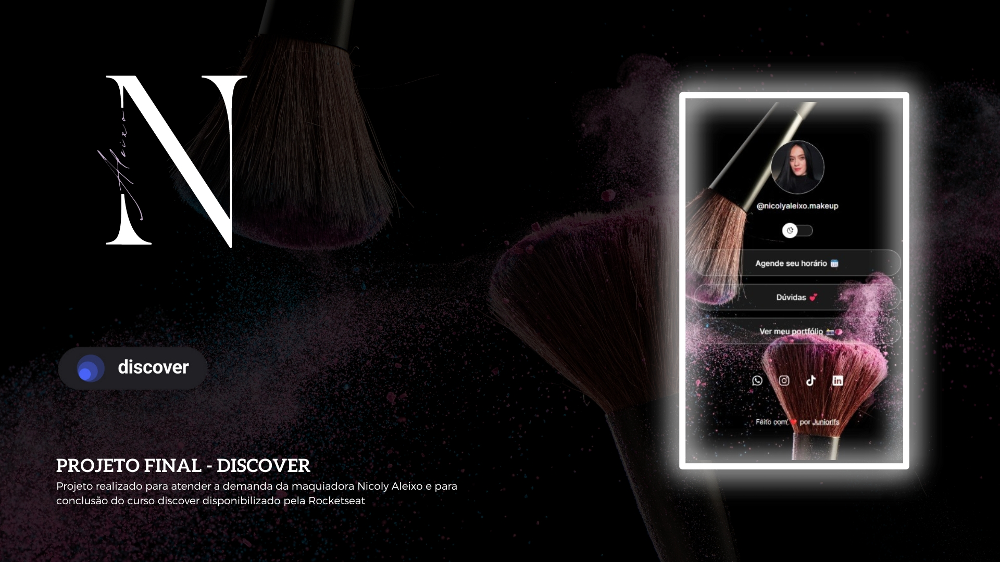

<h1 align="center"> Projeto final - Discover </h1>

Projeto de conclusão do curso promovido pela Rocketseat para ensino de tecnologias WEB.

  <a href="#-tecnologias">Tecnologias</a>&nbsp;&nbsp;&nbsp;|&nbsp;&nbsp;&nbsp;
  <a href="#-projeto">Projeto</a>&nbsp;&nbsp;&nbsp;|&nbsp;&nbsp;&nbsp;
  <a href="#memo-licença">Licença</a>

  

 

  

## 🚀 Tecnologias

Esse projeto foi desenvolvido com as seguintes tecnologias:

- HTML e CSS
- JavaScript
- Git e Github

## 💻 Projeto

Agregador de links para a maquiadora Nicoly Aleixo "❤️💍" usar como um cartão de visitas online.

## :memo: Licença

Esse projeto está sob a licença MIT.

---

Feito com ❤️ by Juniorlfs :wave: [Entre em contato!](https://wa.me/+5541985171885)
